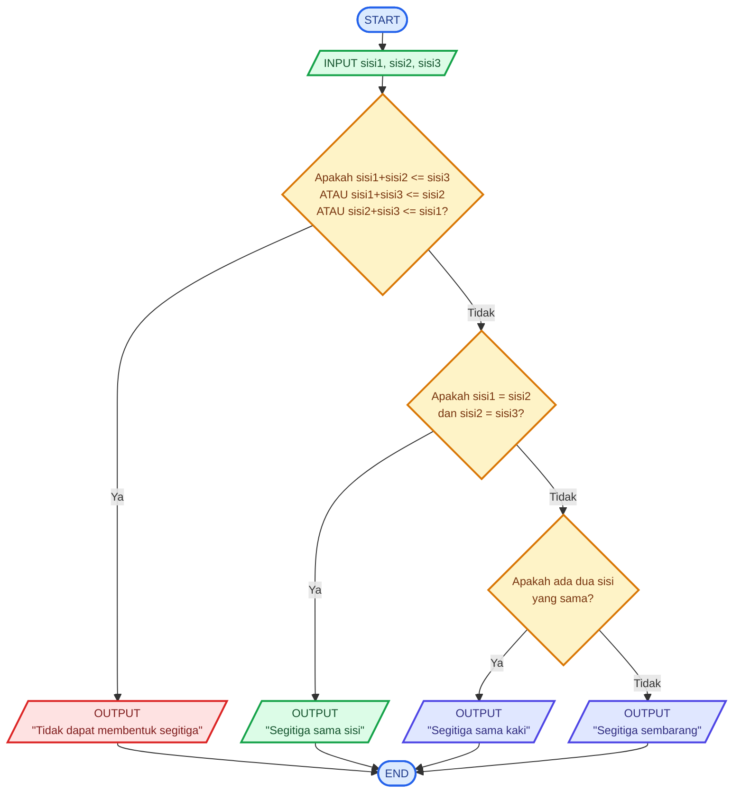

# Kelas-E-Algoritma-Pemrograman

# 🧮 Logika Matematika – Menentukan Jenis dan Validitas Segitiga

## 📝 Deskripsi Masalah

Dalam pembelajaran matematika, segitiga merupakan bangun datar yang memiliki tiga sisi. Berdasarkan panjang sisinya, segitiga dapat dibedakan menjadi **segitiga sama sisi, segitiga sama kaki, dan segitiga sembarang**.

Namun, tidak semua tiga bilangan yang diberikan dapat membentuk sebuah segitiga. Agar tiga sisi dapat membentuk segitiga, harus memenuhi **syarat ketaksamaan segitiga**, yaitu jumlah panjang dua sisi harus lebih besar daripada panjang sisi ketiga.

Program ini dibuat untuk membantu menentukan apakah tiga panjang sisi dapat membentuk sebuah segitiga. Jika ketiga sisi memenuhi syarat, program kemudian menentukan jenis segitiga berdasarkan panjang sisinya.

Program akan menerima tiga nilai sebagai input, yaitu panjang sisi pertama, sisi kedua, dan sisi ketiga. Program terlebih dahulu memeriksa validitas ketiga sisi menggunakan operator logika. Jika tidak memenuhi syarat segitiga, program akan menampilkan bahwa ketiga sisi tersebut tidak dapat membentuk segitiga.

Jika ketiga sisi valid, program akan menentukan jenis segitiga. Jika ketiga sisi sama, maka termasuk **segitiga sama sisi**. Jika terdapat dua sisi yang sama, maka termasuk **segitiga sama kaki**. Jika ketiga sisi berbeda, maka termasuk **segitiga sembarang**.

Program ini menerapkan konsep **perbandingan, ketaksamaan segitiga, operator logika, dan percabangan `if-elif-else`** dalam menyelesaikan permasalahan matematika.

---

## 📥 Input-Proses-Output

### **Input**

Program menerima tiga buah nilai berupa panjang sisi segitiga:

* `sisi1` = panjang sisi pertama
* `sisi2` = panjang sisi kedua
* `sisi3` = panjang sisi ketiga

### **Proses**

Program melakukan dua tahap pemeriksaan.

**Tahap 1 – Mengecek validitas segitiga**

Program memeriksa apakah memenuhi semua syarat berikut:

```text
sisi1 + sisi2 > sisi3
sisi1 + sisi3 > sisi2
sisi2 + sisi3 > sisi1
```

Jika salah satu syarat tidak terpenuhi, maka ketiga sisi tersebut **tidak dapat membentuk segitiga**.

**Tahap 2 – Menentukan jenis segitiga**

Jika ketiga sisi valid:

* Jika `sisi1 = sisi2 = sisi3`, maka **segitiga sama sisi**.
* Jika terdapat dua sisi yang sama, maka **segitiga sama kaki**.
* Jika ketiga sisi berbeda, maka **segitiga sembarang**.

### **Output**

Program menampilkan:

* **"Ketiga sisi tersebut tidak dapat membentuk segitiga"**, jika sisi tidak memenuhi syarat.
* **"Segitiga sama sisi"**, jika ketiga sisi sama.
* **"Segitiga sama kaki"**, jika terdapat dua sisi yang sama.
* **"Segitiga sembarang"**, jika ketiga sisi berbeda.

---

# 💻 Pseudocode

```text
START

INPUT sisi1
INPUT sisi2
INPUT sisi3

IF sisi1 + sisi2 <= sisi3 OR
   sisi1 + sisi3 <= sisi2 OR
   sisi2 + sisi3 <= sisi1 THEN

    OUTPUT "Ketiga sisi tersebut tidak dapat membentuk segitiga"

ELSE IF sisi1 = sisi2 AND sisi2 = sisi3 THEN

    OUTPUT "Segitiga sama sisi"

ELSE IF sisi1 = sisi2 OR
        sisi1 = sisi3 OR
        sisi2 = sisi3 THEN

    OUTPUT "Segitiga sama kaki"

ELSE

    OUTPUT "Segitiga sembarang"

END IF

END
```

---

# 📊 Flowchart



---

# 🧪 Test Case

| Test Case | Sisi 1 | Sisi 2 | Sisi 3 | Kondisi                                            | Hasil yang Diharapkan          |
| --------- | -----: | -----: | -----: | -------------------------------------------------- | ------------------------------ |
| 1         |      5 |      5 |      5 | Ketiga sisi sama dan memenuhi syarat segitiga      | Segitiga sama sisi             |
| 2         |      5 |      5 |      8 | Dua sisi sama dan memenuhi syarat segitiga         | Segitiga sama kaki             |
| 3         |      5 |      6 |      8 | Ketiga sisi berbeda dan memenuhi syarat segitiga   | Segitiga sembarang             |
| 4         |      2 |      3 |     10 | Tidak memenuhi syarat segitiga                     | Tidak dapat membentuk segitiga |

---

# 🐍 Implementasi Python

Implementasi program dibuat menggunakan bahasa pemrograman **Python** dan dijalankan melalui **Visual Studio Code**. Program menggunakan percabangan `if`, `elif`, dan `else`, serta operator logika `and` dan `or`.

Program terlebih dahulu mengecek apakah ketiga panjang sisi memenuhi syarat untuk membentuk segitiga. Setelah dinyatakan valid, program akan menentukan jenis segitiga berdasarkan kesamaan panjang sisinya.

### **Source Code `main.py`**

```python
sisi1 = int(input("Masukkan panjang sisi 1: "))
sisi2 = int(input("Masukkan panjang sisi 2: "))
sisi3 = int(input("Masukkan panjang sisi 3: "))

if sisi1 + sisi2 <= sisi3 or sisi1 + sisi3 <= sisi2 or sisi2 + sisi3 <= sisi1:
    print("Yahhh....Ketiga sisi tersebut tidak bisa membentuk segitiga")
elif sisi1 == sisi2 and sisi2 == sisi3:
    print("Segitiga sama sisi")
elif sisi1 == sisi2 or sisi1 == sisi3 or sisi2 == sisi3:
    print("Segitiga sama kaki")
else:
    print("Segitiga sembarang")
```

---

# 📸 Hasil Pengujian

Program telah diuji menggunakan beberapa kombinasi panjang sisi untuk memastikan bahwa program dapat menentukan validitas dan jenis segitiga dengan benar.

Pada pengujian pertama, digunakan sisi **5, 5, dan 5**. Ketiga sisi memenuhi syarat segitiga dan memiliki panjang yang sama, sehingga program menghasilkan **"Segitiga sama sisi"**.


Pada pengujian kedua, digunakan sisi **5, 5, dan 8**. Ketiga sisi memenuhi syarat segitiga dan terdapat dua sisi yang sama, sehingga program menghasilkan **"Segitiga sama kaki"**.


Pada pengujian ketiga, digunakan sisi **5, 6, dan 8**. Ketiga sisi memenuhi syarat segitiga dan memiliki panjang yang berbeda, sehingga program menghasilkan **"Segitiga sembarang"**.


Pada pengujian keempat, digunakan sisi **2, 3, dan 10**. Karena jumlah dua sisi tidak lebih besar dari sisi ketiga, ketiga sisi tersebut tidak dapat membentuk segitiga. Program menghasilkan **"Ketiga sisi tersebut tidak dapat membentuk segitiga"**.


Berdasarkan hasil pengujian tersebut, program dapat melakukan pengecekan validitas sekaligus menentukan jenis segitiga berdasarkan panjang ketiga sisinya.

---

# 📌 Kesimpulan

Berdasarkan program yang telah dibuat, dapat disimpulkan bahwa konsep **logika matematika dan percabangan dalam pemrograman** dapat digunakan untuk menyelesaikan permasalahan dalam pembelajaran matematika.

Program tidak hanya menentukan jenis segitiga berdasarkan panjang sisi, tetapi juga melakukan pengecekan terlebih dahulu menggunakan **syarat ketaksamaan segitiga**. Dengan demikian, program dapat membedakan antara tiga panjang sisi yang benar-benar dapat membentuk segitiga dan tiga panjang sisi yang tidak memenuhi syarat.

Melalui program ini, konsep **perbandingan, operator logika, ketaksamaan, dan percabangan** dapat diterapkan secara langsung dalam sebuah permasalahan matematika.
