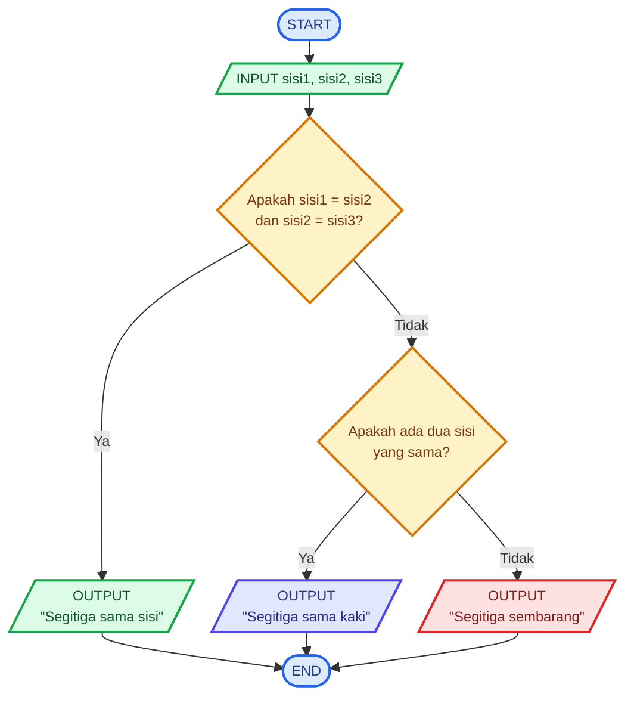

# Kelas-E-Algoritma-Pemrograman

# 🧮 Logika Matematika – Menentukan Jenis Segitiga Berdasarkan Panjang Sisi

## 📝 Deskripsi Masalah

Dalam pembelajaran matematika, segitiga merupakan salah satu bangun datar yang memiliki tiga sisi. Berdasarkan panjang sisinya, segitiga dapat dibedakan menjadi **segitiga sama sisi, segitiga sama kaki, dan segitiga sembarang**.

Untuk membantu siswa memahami materi tersebut, dibuat sebuah program sederhana yang dapat menentukan jenis segitiga berdasarkan panjang ketiga sisinya. Program akan menerima tiga nilai sebagai input, yaitu panjang sisi pertama, sisi kedua, dan sisi ketiga.

Program kemudian membandingkan ketiga sisi tersebut menggunakan logika matematika. Jika ketiga sisi memiliki panjang yang sama, maka segitiga termasuk **segitiga sama sisi**. Jika terdapat dua sisi yang memiliki panjang sama, maka segitiga termasuk **segitiga sama kaki**. Jika ketiga sisi memiliki panjang yang berbeda, maka segitiga termasuk **segitiga sembarang**.

Program ini menerapkan konsep **perbandingan, operator logika, dan percabangan** untuk menyelesaikan permasalahan matematika secara sederhana dan sistematis.

---

## 📥 Input-Proses-Output

### **Input**

Program menerima tiga buah nilai berupa panjang sisi segitiga:

* `sisi1` = panjang sisi pertama
* `sisi2` = panjang sisi kedua
* `sisi3` = panjang sisi ketiga

### **Proses**

Program melakukan perbandingan terhadap ketiga panjang sisi:

1. Jika `sisi1 = sisi2` dan `sisi2 = sisi3`, maka segitiga adalah **segitiga sama sisi**.
2. Jika terdapat dua sisi yang memiliki panjang sama, maka segitiga adalah **segitiga sama kaki**.
3. Jika ketiga sisi memiliki panjang yang berbeda, maka segitiga adalah **segitiga sembarang**.

### **Output**

Program menampilkan jenis segitiga berdasarkan panjang ketiga sisinya.

---

## 💻 Pseudocode

```text
START

INPUT sisi1
INPUT sisi2
INPUT sisi3

IF sisi1 = sisi2 AND sisi2 = sisi3 THEN
    OUTPUT "Segitiga sama sisi"

ELSE IF sisi1 = sisi2 OR sisi1 = sisi3 OR sisi2 = sisi3 THEN
    OUTPUT "Segitiga sama kaki"

ELSE
    OUTPUT "Segitiga sembarang"

END IF

END
```

---

## 📊 Flowchart



---

## 🧪 Test Case

| Test Case | Input Sisi 1 | Input Sisi 2 | Input Sisi 3 | Kondisi             | Hasil yang Diharapkan |
| --------- | -----------: | -----------: | -----------: | ------------------- | --------------------- |
| 1         |            5 |            5 |            5 | Ketiga sisi sama    | Segitiga sama sisi    |
| 2         |            5 |            5 |            8 | Dua sisi sama       | Segitiga sama kaki    |
| 3         |            4 |            5 |            6 | Ketiga sisi berbeda | Segitiga sembarang    |

---

## 🐍 Implementasi Python

Program dibuat menggunakan bahasa pemrograman **Python** dan dijalankan melalui **Visual Studio Code**. Program menggunakan percabangan `if`, `elif`, dan `else`, serta operator logika `and` dan `or` untuk menentukan jenis segitiga.

### **Source Code `main.py`**

```python
sisi1 = int(input("Masukkan panjang sisi 1: "))
sisi2 = int(input("Masukkan panjang sisi 2: "))
sisi3 = int(input("Masukkan panjang sisi 3: "))

if sisi1 == sisi2 and sisi2 == sisi3:
    print("Segitiga sama sisi")
elif sisi1 == sisi2 or sisi1 == sisi3 or sisi2 == sisi3:
    print("Segitiga sama kaki")
else:
    print("Segitiga sembarang")
```

---

## 📸 Hasil Pengujian

Program telah diuji menggunakan tiga kondisi yang berbeda. Pengujian pertama menggunakan panjang sisi **5, 5, dan 5**, sehingga program menghasilkan **"Segitiga sama sisi"**.


Pengujian kedua menggunakan panjang sisi **5, 5, dan 8**. Karena terdapat dua sisi yang memiliki panjang sama, program menghasilkan **"Segitiga sama kaki"**.


Pengujian ketiga menggunakan panjang sisi **4, 5, dan 6**. Karena ketiga sisi memiliki panjang yang berbeda, program menghasilkan **"Segitiga sembarang"**.


Berdasarkan hasil pengujian tersebut, program dapat menentukan jenis segitiga dengan benar sesuai dengan kondisi panjang ketiga sisinya.

---

## 📌 Kesimpulan

Berdasarkan program yang telah dibuat, dapat disimpulkan bahwa **logika matematika dapat diterapkan dalam pemrograman untuk menyelesaikan permasalahan sehari-hari maupun permasalahan dalam pembelajaran matematika**.

Pada program ini, konsep perbandingan panjang sisi digunakan bersama dengan operator logika dan percabangan untuk menentukan jenis segitiga. Dengan adanya program ini, proses menentukan jenis segitiga berdasarkan panjang sisinya dapat dilakukan dengan lebih cepat dan mudah.
